# ProVoC

[](https://lifecycle.r-lib.org/articles/stages.html#experimental-1)
[](https://opensource.org/licenses/MIT)

PROportions of Variants of Concern using counts, coverage, and a lineage
definition matrix.

Builds and diagnoses a model based on:

- Counts: The number of times a given mutation was observed.
- Coverage: The number of times the position of a given mutation was
  read.
- Mutation names: whatever format you want, as long as they match the
  names in the lineage definition matrix.
- Lineage definition matrix: A matrix where the row names are lineage,
  the column names are mutations, and the entries are 1 if the row
  lineage has the column mutation and 0 otherwise.
  - For example: Usher Barcodes
  - All current methods accept fractional entries.

# Usage

There are two steps to using this software: create the lineage
definitions and run the model(s).

If not specified, the lineage definitions uses hardcoded definitions
from the
[cov-lineages/constellations](https://github.com/cov-lineages/constellations)
repo, which contains the representative mutations that were identified
by the PANGO team. The lineage definitions must have names that match
what exists in the data.

``` r
#library(provoc)
devtools::load_all()
```

    ℹ Loading provoc

``` r
data(Baaijens)
b1 <- Baaijens [Baaijens$sra == Baaijens$sra[1], ]
b1$mutation <- parse_mutations(b1$label)

head(b1[, c("count", "coverage", "mutation", "label")])
```

      count coverage        mutation   label
    1 14458    14818      aa:S:D614G ~23403G
    2 10431    32699         C12025T ~12025T
    3   759     9577         G29266A ~29266A
    4 23329    23690  aa:orf1a:T265I  ~1059T
    5  6935    32631       aa:M:R44S ~26654T
    6 13866    27715 aa:orf1a:L3352F ~10319T

The main fitting function is designed to mimic `glm()`, with formula
notation that emphasizes the connection to binomial GLM models. The
`bootstrap_samples` argument is optional, and is used to calculate
confidence intervals and correlation of the parameters.

``` r
res <- provoc(
    formula = count / coverage ~ B.1.1.7 + B.1.429 + B.1.617.2 + 
        B.1.427 + AY.4 + P.1,
    data = b1,
    bootstrap_samples = 100)
res
```

    Call: count/coverage ~ B.1.1.7 + B.1.429 + B.1.617.2 + B.1.427 + AY.4 + 
        P.1

    Mutations in lineage definitions:  325 
    Mutations used in analysis/mutations in data:
    74/772

    All models converged.

    Top 5 lineages:
         rho   ci_low ci_high   lineage group
    5  0.515 5.09e-01 0.52084      AY.4     1
    2   0.33 3.23e-01 0.33823   B.1.429     1
    4  0.124 1.18e-01 0.13045   B.1.427     1
    1  0.008 7.08e-03 0.00805   B.1.1.7     1
    3 <0.001 1.36e-09 0.00007 B.1.617.2     1

We have created a class for `provoc` objects with convenient methods.
For example, plotting the results is achieved as follows:

``` r
plot(res)
```

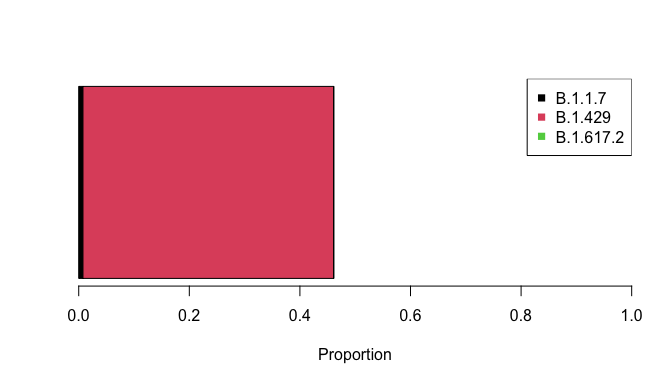

We use the convention of
[`autoplot()`](https://ggplot2.tidyverse.org/reference/autoplot.html) as
a function that creates a `ggplot2` plot based on a particular type of
data. This allows for all of `ggplot2`’s fanciness on top of a pre-made
plot.

``` r
library(ggplot2)
autoplot(res) +
    theme_bw() +
    labs(title = "Results for one sample")
```

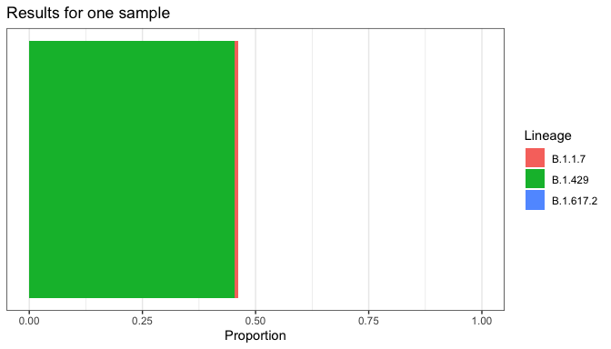

``` r
plot_resids(res)
```

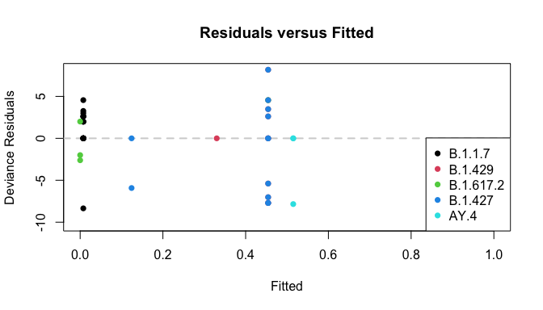

``` r
summary(res)
```


    Call:
    count/coverage ~ B.1.1.7 + B.1.429 + B.1.617.2 + B.1.427 + AY.4 + 
        P.1

    Deviance Residuals:
        Min.  1st Qu.   Median     Mean  3rd Qu.     Max. 
    -10.3051  -1.9998   0.0000  -0.7594   0.0000   8.1775 

    Mutations in lineage definitions: 325 
    Mutations used in analysis/mutations in data:
    74/772

    Coefficients:
               rho       ci_low      ci_high   lineage
    1 7.599439e-03 7.081703e-03 8.050048e-03   B.1.1.7
    2 3.301205e-01 3.234749e-01 3.382267e-01   B.1.429
    3 9.512833e-09 1.362086e-09 6.996912e-05 B.1.617.2
    4 1.242872e-01 1.184034e-01 1.304502e-01   B.1.427
    5 5.150303e-01 5.086749e-01 5.208370e-01      AY.4

    Correlation of coefficients:
                  B.1.1.7     B.1.429  B.1.617.2     B.1.427        AY.4
    B.1.1.7    1.00000000  0.01371296  0.2091873 -0.02628246 -0.18810506
    B.1.429    0.01371296  1.00000000  0.1868977 -0.89024937  0.03164538
    B.1.617.2  0.20918734  0.18689767  1.0000000 -0.16716463 -0.11556907
    B.1.427   -0.02628246 -0.89024937 -0.1671646  1.00000000  0.03870984
    AY.4      -0.18810506  0.03164538 -0.1155691  0.03870984  1.00000000

``` r
plot_lineages(res)
```

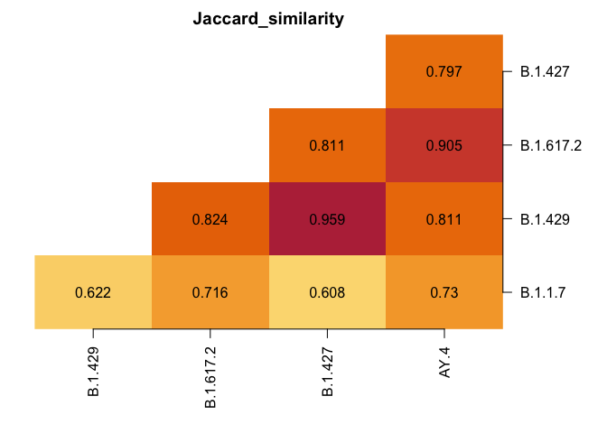

# Multiple Samples

``` r
# First thirty samples from Baaijens
b2 <- Baaijens [Baaijens$sra %in% unique(Baaijens$sra)[1:30], ]
b2$mutations <- parse_mutations(b2$label)
head(b1[, c("count", "coverage", "mutation", "label", "sra")])
```

      count coverage        mutation   label         sra
    1 14458    14818      aa:S:D614G ~23403G SRR15505102
    2 10431    32699         C12025T ~12025T SRR15505102
    3   759     9577         G29266A ~29266A SRR15505102
    4 23329    23690  aa:orf1a:T265I  ~1059T SRR15505102
    5  6935    32631       aa:M:R44S ~26654T SRR15505102
    6 13866    27715 aa:orf1a:L3352F ~10319T SRR15505102

Note the “`by`” argument below. This tells `provoc()` to fit the model
separately to each sample defined by the `by` column. Since there are 30
samples, the model takes a while to run, hence why there are no
bootstrap samples here.

``` r
system.time(
    res <- provoc(
        formula = count / coverage ~ B.1.1.7 + B.1.429 + B.1.617.2 +
            B.1.427 + AY.4 + P.1,
        data = b2, 
        by = "sra",
        bootstrap_samples = 0)
)
```

    [1] "Attempt 10 of 20."
    [1] "Attempt 20 of 20."

       user  system elapsed 
      1.819   0.020   1.848 

``` r
res
```

    Call: count/coverage ~ B.1.1.7 + B.1.429 + B.1.617.2 + B.1.427 + AY.4 + 
        P.1

    Mutations in lineage definitions:  325 
    Summary of percent of mutations in data used:
       Min. 1st Qu.  Median    Mean 3rd Qu.    Max. 
    0.09585 0.09585 0.09585 0.09585 0.09585 0.09585 

    All models converged.

    Top 6 lineages:
          rho ci_low ci_high lineage       group avg_spot_len sample_name     bases
    61  0.899     NA      NA B.1.1.7 SRR15505114          302         FX2 385650980
    15  0.846     NA      NA    AY.4 SRR15505104          302         DR2 412520222
    139  0.84     NA      NA B.1.427 SRR15505129          302         FE1 339620744
    114 0.709     NA      NA B.1.427 SRR15505124          302         FK2 433136554
    50  0.695     NA      NA    AY.4 SRR15505111          302         GC1 484282368
    35  0.687     NA      NA    AY.4 SRR15505108          302         GF2 615765014
         bioproject       date
    61  PRJNA741211 2021-04-11
    15  PRJNA741211 2021-01-15
    139 PRJNA741211 2021-03-16
    114 PRJNA741211 2021-03-24
    50  PRJNA741211 2021-04-17
    35  PRJNA741211 2021-04-23

``` r
plot_lineages(res)
```


The plotting functions above work as expected.

``` r
plot(res)
```

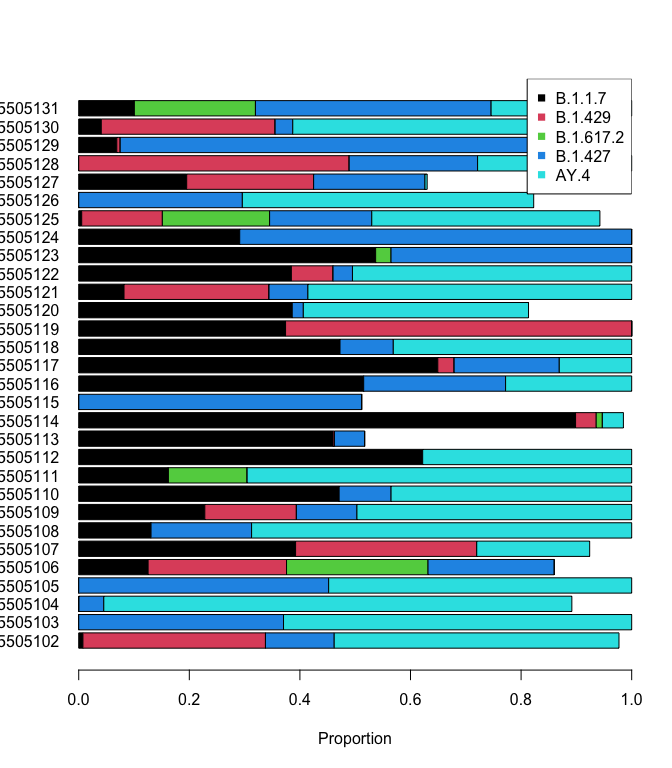

``` r
plot_resids(res)
```

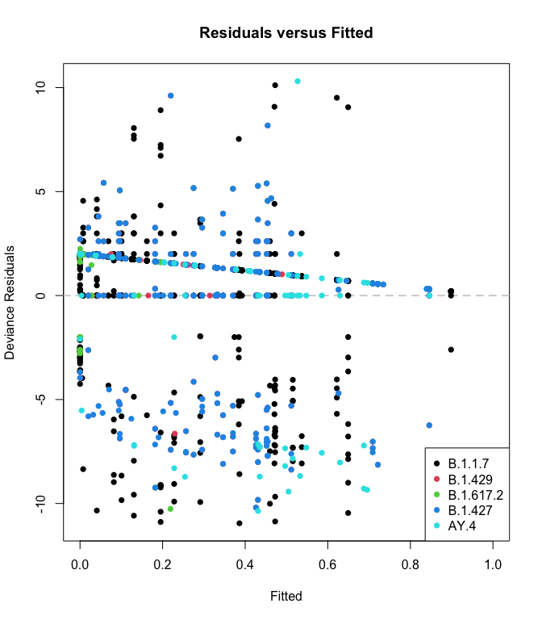

``` r
autoplot(res)
```

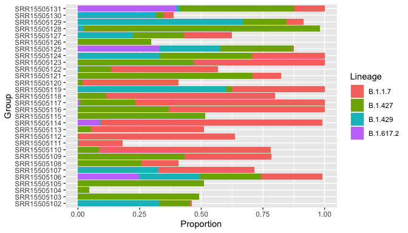

In addition, we’ve added special functionality for data with a “date”
column:

``` r
theme_set(theme_bw())
res$date <- lubridate::ymd(res$date)
autoplot(res, date_col = "date")
```

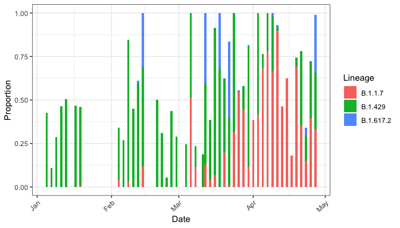

Since `autoplot()` returns a `ggplot2` object, you can use all your
knowledge of ggplot2:

``` r
autoplot(res, date_col = "date") +
    facet_wrap(~ lineage, nrow = 1) +
    labs(title = "Proportions of Lineages over Time") +
    theme(axis.text.x = element_text(angle = 45, hjust = 1))
```

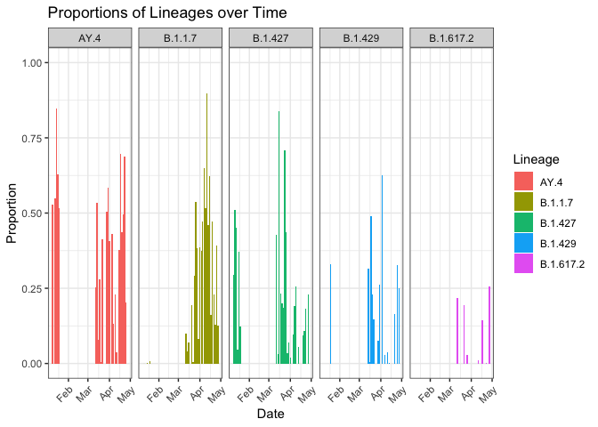

Finally, the residual plot still works (although it’s a bunch of samples
stuffed into one plot, so its use is limited.)

``` r
plot_resids(res)
```

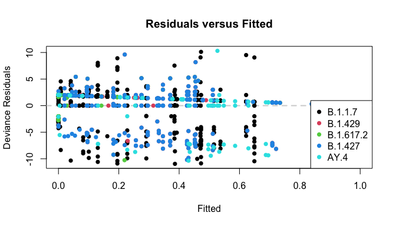

## Searching for Different Lineages

``` r
library(patchwork)
res_with <- provoc(cbind(count, coverage) ~ B.1.1.7 + B.1.429 + B.1.617.2 + B.1.427,
    data = b2, by = "sra",
    verbose = FALSE, bootstrap_samples = 0)
res_with$date <- lubridate::ymd(res_with$date)

res_without <- provoc(cbind(count, coverage) ~ B.1.429 + B.1.617.2 + B.1.427,
    data = b2, by = "sra",
    verbose = FALSE, bootstrap_samples = 0)
res_without$date <- lubridate::ymd(res_without$date)

g_with <- autoplot(res_with, date_col = "date") +
    scale_fill_manual(values = 2:5)
g_without <- autoplot(res_without, date_col = "date") +
    scale_fill_manual(values = 3:5)

g_with / g_without
```

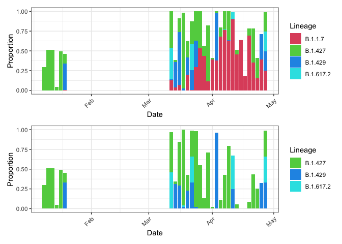

Notice two important points:

1.  Since proportions can’t sum to greater than one, including B.1.1.7
    when it should be excluded means it will take away from the other
    lineages!
    - Erroneously **increasing** one means **decreasing** true lineages.
2.  Due to shared mutations, excluding B.1.1.7 when it should be
    included means other lineages increase to make up for it.
    - Erroneously **decreasing** one means **increasing** other
      lineages.

`provoc` also accepts the `~ .` formula notation. This is useful if you
want to manipulate the lineages in the lineage definitions matrix, which
is easier programmatically than dealing with formulae in R. The
`filter_lineages()` function will remove mutations that are not present
in any of the remaining lineages.

``` r
lineage_defs <- provoc::usher_barcodes(path = "working") |>
    filter_lineages(c("B.1.1.7", "B.1.617.2", "B.1.427",
        "B.1.429", "AY.4", "BA.4", "BA.5"))
```

With these definitions, we can just use all of them:

``` r
res_all <- provoc(count / coverage ~ ., data = b1, 
    bootstrap_samples = 0,
    lineage_defs = lineage_defs)

plot_lineages(res_all)
```

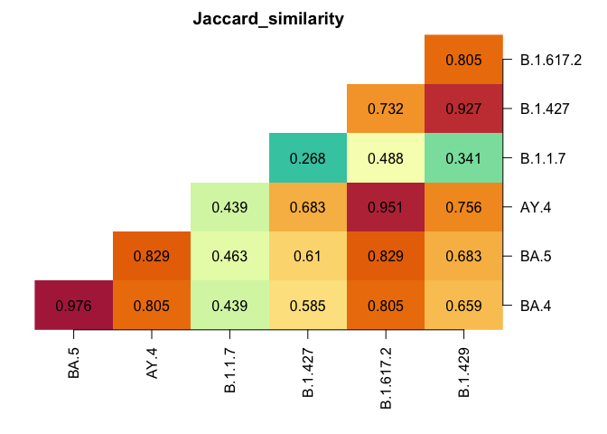

# Version Roadmap

- [x] 0.5: Current version
- [ ] 0.6: Refactor and add methods
  - [ ] Standardize to use “lineage” everywhere
  - [ ] General ease of use for fitting multiple models, checking
    lineage definitions, and checking diagnostics.
  - [ ] Correct documentation errors and vestiges
- [ ] 0.7: Better handling of multiple samples
  - [ ] Proper diagnostics, easily applied to all samples
  - [ ] `multiprovoc` class so functions know how to handle things?
- [ ] 0.8: Multiple methods
  - [ ] Freyja and AlCoV (possibly others) as first-class objects, with
    access to methods for `provoc` objects.
    - Potentially loading in Freyja output files as `provoc` objects
  - [ ] Stacking (`cbind()`) models for ease of comparison
  - [ ] Import and process iVar data.
  - [ ] Main function works for multiple methods and data sources.
  - [ ] Unified `parse_mutations()` function with minimal user input.
- [ ] 0.9: The shiny minor version
  - [ ] Shiny app to interact with lineage defitions
  - [ ] Shiny app to interact with results
- [ ] 1.0: First major release
  - [ ] All functions unit-tested and debugged
  - [ ] Vignettes fully built
  - [ ] All documentation up-to-date and built via `pkgdown`
  - \[ \]
